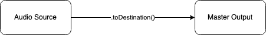

+++
title = "Web Audio Basics and Sound File Players"
outputs = ["Reveal"]
[reveal_hugo]
custom_theme = "reveal-hugo/themes/robot-lung.css"
margin = 0.2
separator = "##"
+++

# Project Setup

## Editor

- Local
  - [Visual Studio Code](https://code.visualstudio.com/), my choice
  - Atom
  - Sublime
- Cloud
  - [p5 editor](https://editor.p5js.org/)
  - [CodePen](https://codepen.io/)
  - [CodeSandBox](codesandbox.io/)

---

# WEBAUDIO BASICS & SOUND FILE PLAYERS

---

## Understanding the Audio Signal Path



ex:

```javascript
const player = new Tone.Player().toDestination();
```

---

## Creating a Sound File Player

<iframe src="https://codesandbox.io/embed/creating-a-sound-file-player-ro149c?fontsize=14&hidenavigation=1&theme=dark&view=preview"
     style="width:100%; height:500px; border:0; border-radius: 4px; overflow:hidden;"
     title="creating a sound file player"
     allow="accelerometer; ambient-light-sensor; camera; encrypted-media; geolocation; gyroscope; hid; microphone; midi; payment; usb; vr; xr-spatial-tracking"
     sandbox="allow-forms allow-modals allow-popups allow-presentation allow-same-origin allow-scripts"
   ></iframe>

## [starter template](https://codesandbox.io/s/creating-a-sound-file-player-starter-1uz361?file=%2Fsketch.js)

---

## Playing Multiple Sounds with Tone.Players

{}
Instead of making multiple single-file soundfile players, we can build one Tone.Players instrument and load it with multiple soundfiles. To define which sounds to play we create an object with multiple file paths (done by opening a pair of { } brackets inside of the Tone.Players functions parenthesis), each with a unique name to call the sound up by later. You can think of this name as a type of variable that is inside of an object.

Since we are now dealing with multiple sound files, we should cover some of the best ways to trigger individual sounds in your project, as well as ways to modulate and manipulate those sounds while they are playing.

{}

---

### Triggering and changing sounds

- keyIsDown
- <button> Buttons</button>
- sliders. <input type="range" min="1" max="100" value="50" class="slider" id="myRange">

{}

Since we have multiple sounds to play now we can use keys on the keyboard to trigger them. To do that we use the p5 function keyIsDown. The embedded code below shows this method in action.

{}

---

#### Starting the sounds

store multiple samples in a Players object

```js
const sounds = new Tone.Players({
  name1: "url",
  name2: "url",
  name3: "url",
});
```

select sample

```js
sounds.player("name1");
```

play sample

```js
sounds.player("name1").start();
```

---

## Tone Players example

<iframe src="https://codesandbox.io/embed/creating-sound-file-players-y9j0j5?fontsize=14&hidenavigation=1&theme=dark&view=preview"
     style="width:100%; height:500px; border:0; border-radius: 4px; overflow:hidden;"
     title="creating sound file players"
     allow="accelerometer; ambient-light-sensor; camera; encrypted-media; geolocation; gyroscope; hid; microphone; midi; payment; usb; vr; xr-spatial-tracking"
     sandbox="allow-forms allow-modals allow-popups allow-presentation allow-same-origin allow-scripts"
   ></iframe>

Fork your previous example and create one players object

---

# Using buttons

Alternatives to **keyPressed**?
<button>Buttons!!</button>
<button>Buttons!!</button>
<button>Buttons!!</button>
<button>Buttons!!</button>

---

- p5.js gives you access to the DOM (Document Object Model)
  - **createButton()**.
- Position it
  - **button1.position(x, y)**
- listen on it
  - **button1.mousePressed()**

ex:

```js
button1 = createButton("button label");
button1.position(x, y);
button1.mousePressed();
```

---

## play sample with buttons

<iframe src="https://codesandbox.io/embed/play-a-sample-with-buttons-0kqe1f?fontsize=14&hidenavigation=1&theme=dark&view=preview"
     style="width:100%; height:500px; border:0; border-radius: 4px; overflow:hidden;"
     title="play a sample with buttons"
     allow="accelerometer; ambient-light-sensor; camera; encrypted-media; geolocation; gyroscope; hid; microphone; midi; payment; usb; vr; xr-spatial-tracking"
     sandbox="allow-forms allow-modals allow-popups allow-presentation allow-same-origin allow-scripts"
   ></iframe>

## [starting template](https://codesandbox.io/s/play-a-sample-with-buttons-starter-zx66cj?file=%2Fsketch.js)

---

## Using sliders

Change the sound while it's playing.

To make a slider in p5.js use createSlider().

##### Syntax

```
createSlider(min,max,[value],[step]);
```

---

## Parameters

- _min_ - minimum value of the slider
- _max_ - maximum value of the slider
- _value_ - default value of the slider
- _step_ - step size for each tick of the slider (if step is set to 0, the slider will move continuously from the minimum to the maximum value)

Current slider value is stored in **slider.value()**

---

## Labeling your sampler

For the assignment you need to label your sampler:

#### Syntax

```
text(str,x,y);
```

##### Parameters

- _str_ - text content
- _y_ - the y axis coordinate of text
- _x_ - the x axis coordinate of text

---

## Change playback speed with slider

<iframe src="https://codesandbox.io/embed/change-sampler-plackback-speed-with-slider-wxuy7d?fontsize=14&hidenavigation=1&theme=dark&view=preview"
     style="width:100%; height:500px; border:0; border-radius: 4px; overflow:hidden;"
     title="change sampler plackback speed with slider"
     allow="accelerometer; ambient-light-sensor; camera; encrypted-media; geolocation; gyroscope; hid; microphone; midi; payment; usb; vr; xr-spatial-tracking"
     sandbox="allow-forms allow-modals allow-popups allow-presentation allow-same-origin allow-scripts"
   ></iframe>
