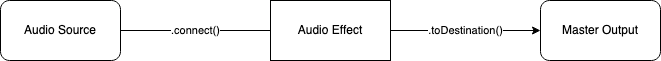

+++
title = "Audio Effects"
outputs = ["Reveal"]
[reveal_hugo]
custom_theme = "reveal-hugo/themes/robot-lung.css"
margin = 0.2
separator = "##"
+++

# Adding Audio Effects to the Signal Path



---

## Connections

- [more info](https://github.com/Tonejs/Tone.js/wiki/Connections)
- **.connect()** connects two nodes together, usually something that makes sound to something that manipulates it
  - ex: sampler -> distortion
- Connections are directional, order matters
  - ex: **source.connect(effect)** can be thought of as source -> effect

---

## Connect effect

- Build our chosen audio effect, assign it to a variable, and connect its output to the speakers (using the .toDestination( ) method)
- the effect needs to get created first before you can send a sound through it

```js
var effect = new Tone.FeedbackDelay().toDestination();
```

- Build our sound source, assign it to a variable, and connect its output to our
  audio effect (using a new method called .connect( )

```js
var multiplayer = new Tone.Players({...}).connect(effect);
```

---

## Changing effects parameters for signals

example:
[FeedBack Delay Docs](https://tonejs.github.io/docs/14.7.77/FeedbackDelay)

- signals have the (~) by them in the docs
- allows audio rate (44,100 Hz)control over attribute
  - [See for more info about sampling rates](http://digitalsoundandmusic.com/5-1-2-digitization/)

see [signal wiki](https://github.com/Tonejs/Tone.js/wiki/Signals#setting-values)

---

## Delay example

<iframe src="https://codesandbox.io/embed/sampler-delay-9d6g51?fontsize=14&hidenavigation=1&theme=dark&view=preview"
     style="width:100%; height:500px; border:0; border-radius: 4px; overflow:hidden;"
     title="sampler + delay"
     allow="accelerometer; ambient-light-sensor; camera; encrypted-media; geolocation; gyroscope; hid; microphone; midi; payment; usb; vr; xr-spatial-tracking"
     sandbox="allow-forms allow-modals allow-popups allow-presentation allow-same-origin allow-scripts"
   ></iframe>

[starter](https://codesandbox.io/s/sampler-delay-starter-zo4v74?file=%2Fsketch.js)

---

## Other Effects examples

- [Tone examples](https://tonejs.github.io/examples/)
- [Interactive Presets](https://www.guitarland.com/MusicTheoryWithToneJS/Presets-gh-pages/)

---

## Reverb

- the persistance of a sound that continues after the original sound has ceased
- many echos bouncing off the walls, think the sound clapping in a cathedral or cave
- all spaces produce reverb
- Tone's two types:
  - [`JCReverb`](https://tonejs.github.io/docs/14.7.77/JCReverb) - a simple Schroeder Reverberator tuned by John Chowning in 1970 - cheap but artificial sounding
  - [`Reverb`](https://tonejs.github.io/docs/14.7.77/Reverb) - convolution, more expensive than the JCReverb but more natural

---

<iframe src="https://codesandbox.io/embed/samper-reverb-fm7sc9?fontsize=14&hidenavigation=1&theme=dark&view=preview"
     style="width:100%; height:500px; border:0; border-radius: 4px; overflow:hidden;"
     title="samper + reverb"
     allow="accelerometer; ambient-light-sensor; camera; encrypted-media; geolocation; gyroscope; hid; microphone; midi; payment; usb; vr; xr-spatial-tracking"
     sandbox="allow-forms allow-modals allow-popups allow-presentation allow-same-origin allow-scripts"
   ></iframe>

[starter](https://codesandbox.io/s/samper-reverb-starter-t960pl?file=%2Fsketch.js)

---

Let's build a serial effects chain - pick three effects;

How do we build this?

---

## More examples

[here](https://pdm.lsupathways.org/3_audio/1_sampler/2_lesson_2/)

---
