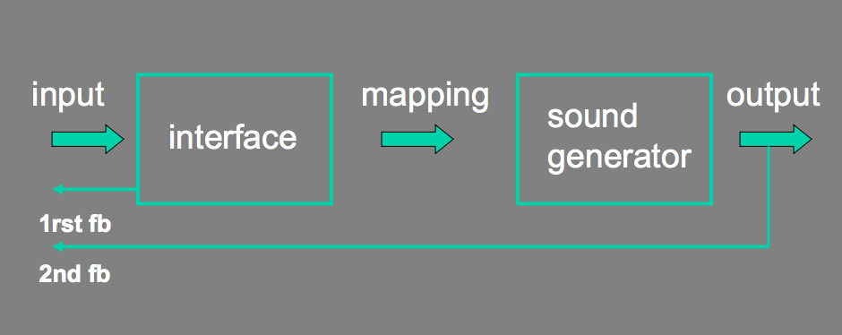
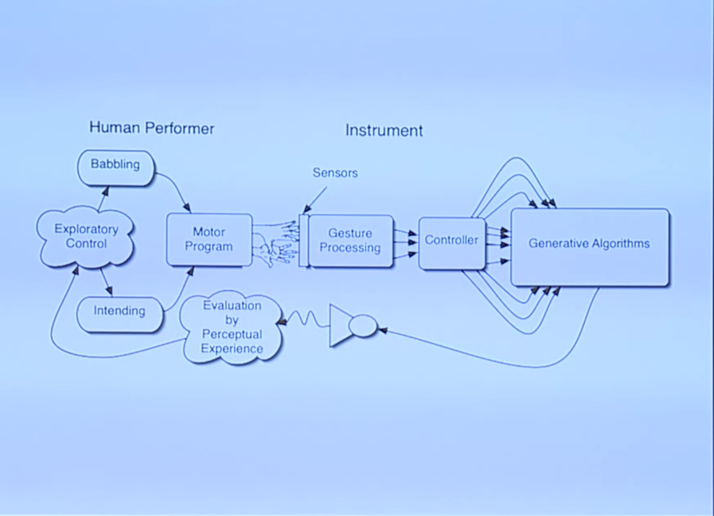

+++
title = "Musical Interfaces"
outputs = ["Reveal"]
[reveal_hugo]
custom_theme = "reveal-hugo/themes/robot-lung.css"
margin = 0.2
separator = "##"
+++

# Musical Interfaces

[source](https://tambien.github.io/InteractiveMusic/module/musical_interfaces)

---

### Acoustic Interfaces

- Sound source and interface are the same.
- Fixed mapping.
- Haptic Feedback.

---

### Electronic Instruments

- Sound and interface are separated by Mapping
- No built in feedback.
- Indirect / Abstract mapping possible.

---

### Purpose / Context

The purpose / context of the interface is extremely important.

- Is the user an expert of amateur?
- What sort of music is created with the instrument?
- How might an interface for composition be different than an instrument for improvisation?
- Ergonomics?
- Relationship between performer and audience.
  - Is it clear what the performer is doing? How she is manipulating sound?
  - How does this change in the context of interactive music which might not have the same notion of audience?

---

### Interaction Model

The interaction model is how people use the interface and how it responds to them (and importantly, how they respond back to it responding). Feedback!

---

### Basic

---

##### Improvisatory Interaction Model

---

Plork

<iframe width="560" height="315" src="https://www.youtube.com/embed/gOsaANAfZcw" title="YouTube video player" frameborder="0" allow="accelerometer; autoplay; clipboard-write; encrypted-media; gyroscope; picture-in-picture" allowfullscreen></iframe>

---

K-Bow

<iframe width="560" height="315" src="https://www.youtube.com/embed/LmzbZ8pyPd0" title="YouTube video player" frameborder="0" allow="accelerometer; autoplay; clipboard-write; encrypted-media; gyroscope; picture-in-picture" allowfullscreen></iframe>

[More info](https://www.keithmcmillen.com/labs/k-bow/)

---

Jazzmutant Lemur

<iframe width="560" height="315" src="https://www.youtube.com/embed/X_BMnwIbWJw" title="YouTube video player" frameborder="0" allow="accelerometer; autoplay; clipboard-write; encrypted-media; gyroscope; picture-in-picture" allowfullscreen></iframe>

---

# Design Rules

Source: [Tambien](https://tambien.github.io/InteractiveMusic/module/interface_design) + [Shneiderman](https://www.cs.umd.edu/users/ben/goldenrules.html)

{}
What are some rules we can use for effective interface design?
{}

---

## Strive for consistency

> Consistent sequences of actions should be required in similar situations; identical terminology should be used in prompts, menus, and help screens; and consistent color, layout, capitalization, fonts, and so on, should be employed throughout.

---

#### Instrument

It's crucial that the listener/instrumentalist knows what the interface is going to do, otherwise the output will seem either random, or like the player is not in control.

#### API

Users of your software shouldn't have to look at the documentation for every single method that you define. If you are consistent with naming, parameters and returned values, users will be able to expressively code with your API.

---

## Seek universal usability

> Recognize the needs of diverse users and design for plasticity, facilitating transformation of content. Novice to expert differences, age ranges, disabilities, international variations, and technological diversity each enrich the spectrum of requirements that guides design. Adding features for novices, such as explanations, and features for experts, such as shortcuts and faster pacing, enriches the interface design and improves perceived quality.

---

#### Instrument

Your interface should not be cumbersome, but instead try to make things that understandable and quick to use. Design for both novices and experts. Is it accessible to _everyone_?

#### API

Common functions will need to be typed out over and over again. Are they fast to write? Is there a faster way to do something? Is the language plain and understandable to non-domain-experts?

---

## Offer informative feedback

> For every user action, there should be an interface feedback. For frequent and minor actions, the response can be modest, whereas for infrequent and major actions, the response should be more substantial.

---

#### Instrument

Audio feedback needs to be immediate. If the player is pressing something and not getting something in return, the interface will feel broken or the player will feel like they are not doing it right.

#### API

Methods should perform actions. Avoid too much configuration methods so that the response from your API is immediate and consistent.

---

## Design dialogs to yield closure

> Sequences of actions should be organized into groups with a beginning, middle, and end. Informative feedback at the completion of a group of actions gives users the satisfaction of accomplishment, a sense of relief, a signal to drop contingency plans from their minds, and an indicator to prepare for the next group of actions.

---

#### Instrument

Complex musical interfaces should provide an ending. They should **stop** when the users lift their hands from the instrument.

#### API

Make sure your API is designed around accomplishing something. The user of your API will feel closure if they are able to do what they need with your interfaces

---

## Prevent errors

> As much as possible, design the interface so that users cannot make serious errors

---

#### Instrument

If a button or UI element is reachable, assume it will be pressed. The exploration of the interface should feel **safe**.

#### API

Give default values to your methods, check that passed in values are in a safe range.

---

## Permit easy reversal of actions

> As much as possible, actions should be reversible. This feature relieves anxiety, since users know that errors can be undone, and encourages exploration of unfamiliar options.

---

#### Instrument

While the player is exploring and expressing with the interface, they should quickly be able to change directions if they don't like what they hear.

#### API

try/catch blocks and clear error reporting allows users to handle issues and debug.

---

## Keep users in control

> Experienced users strongly desire the sense that they are in charge of the interface and that the interface responds to their actions.

---

#### Instrument

Again, the player should be in control with clear feedback. They should be able to stop the sound if they want.

#### API

Avoid background unnecessary background updates. What if the user wants something different or to handle a special case, but your software has a mind of its own.

---

## Reduce short-term memory load

> Humans’ limited capacity for information processing in short-term memory (the rule of thumb is that people can remember “seven plus or minus two chunks” of information) requires that designers avoid interfaces in which users must remember information from one display and then use that information on another display.

---

#### Instrument

Make and keep the state visible, if a sound is playing and it is behind a second screen, it is unclear how to change or stop it.

#### API

If possible, make APIs that are stateless, or don't have too much state.
