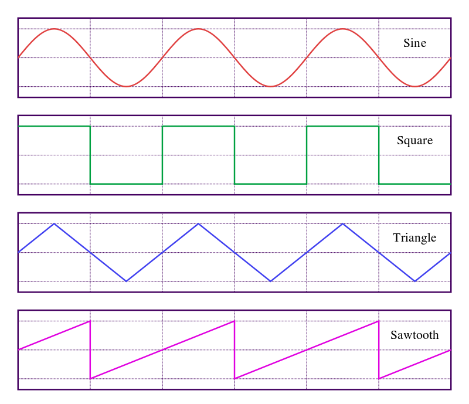

+++
title = "Intro To Synthesis"
outputs = ["Reveal"]
[reveal_hugo]
custom_theme = "reveal-hugo/themes/robot-lung.css"
margin = 0.2
separator = "##"
+++

# Amplitude, Pitch etc

[Learning Synths](https://learningsynths.ableton.com/en/get-started)

---

## Oscillators

- Building blocks of synthesis
- make sound from scratch
- a signal vibrates at a given frequency producing a sound
- types: sine, square, saw, triangle
- each with their own timbre or tone color

---

<!-- oscillator diagrams -->

---

<iframe src="https://tonejs.github.io/examples/oscillator.html" style="width: 100%" height="400"></iframe>

---

## Simple example in Tone

<iframe src="https://codesandbox.io/embed/synth-intro-y4wjx6?fontsize=14&hidenavigation=1&theme=dark&view=preview"
     style="width:100%; height:500px; border:0; border-radius: 4px; overflow:hidden;"
     title="synth intro"
     allow="accelerometer; ambient-light-sensor; camera; encrypted-media; geolocation; gyroscope; hid; microphone; midi; payment; usb; vr; xr-spatial-tracking"
     sandbox="allow-forms allow-modals allow-popups allow-presentation allow-same-origin allow-scripts"
   ></iframe>

---

Look through the [synth examples](https://tonejs.github.io/examples/) and add the examples to our code.

---

### Synth presets demo

<iframe src="https://codesandbox.io/embed/two-synth-instrument-demo-uztggg?fontsize=14&hidenavigation=1&theme=dark&view=preview"
     style="width:100%; height:500px; border:0; border-radius: 4px; overflow:hidden;"
     title="two synth instrument demo"
     allow="accelerometer; ambient-light-sensor; camera; encrypted-media; geolocation; gyroscope; hid; microphone; midi; payment; usb; vr; xr-spatial-tracking"
     sandbox="allow-forms allow-modals allow-popups allow-presentation allow-same-origin allow-scripts"
   ></iframe>

---

- Try out one of the other synths from the Instrument section of the [documentation](https://tonejs.github.io/docs/14.7.77/AMSynth).
- Create a new instrument that allows you to play two different synths ex. AMSynth and FMSynth. You can pick others if you want
- Create a [selector](https://p5js.org/reference/#/p5/createSelect) that allows the user to select between two different synths.
- Create a [radio button](https://p5js.org/reference/#/p5/createRadio) that allows the user to change presets. See [Guitarland](https://www.guitarland.com/MusicTheoryWithToneJS/Presets-gh-pages/) for presets.
- Use [AudioKeys](https://github.com/kylestetz/AudioKeys) to trigger envelopes
