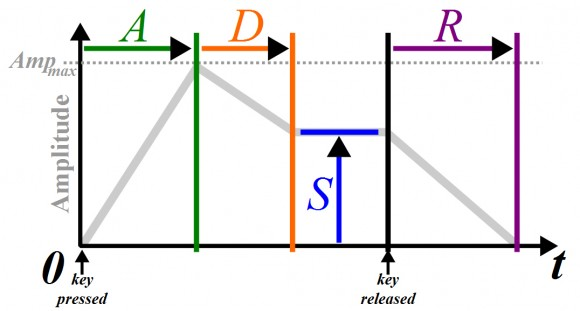
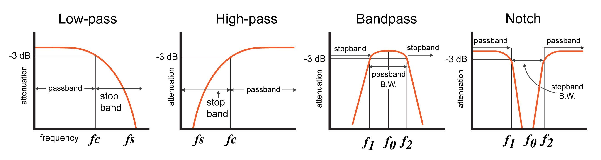
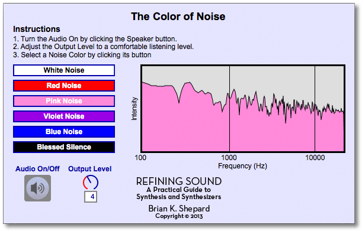

+++
title = "Making a Synth from scratch"
outputs = ["Reveal"]
[reveal_hugo]
custom_theme = "reveal-hugo/themes/robot-lung.css"
margin = 0.2
separator = "##"
+++

# Making a Synth from scratch

---

### Building blocks: Sources and Signals

- A [source](https://github.com/Tonejs/Tone.js/wiki/Sources) in tone is something that produces a sound on its own.
- Sources are combined to make more complex synthesis and sampling instruments. Sources need to be started with .start().

---

- A [signal](https://github.com/Tonejs/Tone.js/wiki/Signals) is something that processes a source.
- Signals are combined to make effects and components.
- Signals are set by using .value = a number

---

### Oscillators

The most basic unit of synthesis in tone is [Tone.Oscillator](https://tonejs.github.io/docs/14.7.77/Oscillator).

- Sine
- Triangle
- Sawtooth
- Square

[example](https://tonejs.github.io/examples/oscillator.html)

---

## Envelopes

- [Tone example](https://tonejs.github.io/examples/envelope.html)
- [Learning Synths - Envelopes](https://learningsynths.ableton.com/en/envelopes/change-over-time)

---

## ADSR

- Attack time is the time taken for initial run-up of level from nil to peak, beginning when the key is first pressed.
- Decay time is the time taken for the subsequent run down from the attack level to the designated sustain level.
- Sustain level is the level during the main sequence of the sound's duration, until the key is released.
- Release time is the time taken for the level to decay from the sustain level to zero after the key is released.

---

## Filters

- A [filter](https://tonejs.github.io/docs/r11/Filter) modifies a source sound by either amplifying or attenuating certain frequency ranges of that sound.
- [Learning Synths - Filters](https://learningsynths.ableton.com/en/filters/filters-in-the-real-world)

---

---

### Filter types can include:

- lowpass
- highpass
- bandpass
- lowshelf
- highshelf
- notch
- allpass
- peaking

---

### Noise

- [Tone.Noise](https://tonejs.github.io/docs/14.7.77/Noise) produces different colors of noise.
- Each has a different sound, covers a different frequency range, and is used for different purposes.
- There are other colors of [noise](https://en.wikipedia.org/wiki/Colors_of_noise) that tone doesn't implement that are good to know about.

---

[Link](https://global.oup.com/us/companion.websites/fdscontent/uscompanion/us/static/companion.websites/9780199922963/Chapter2.html)

---

## Most often used types

- white
- brown
- pink

---

## press any key for noise

<iframe src="https://codesandbox.io/embed/noise-synth-981ti4?fontsize=14&hidenavigation=1&theme=dark&view=preview"
     style="width:100%; height:500px; border:0; border-radius: 4px; overflow:hidden;"
     title="Noise Synth "
     allow="accelerometer; ambient-light-sensor; camera; encrypted-media; geolocation; gyroscope; hid; microphone; midi; payment; usb; vr; xr-spatial-tracking"
     sandbox="allow-forms allow-modals allow-popups allow-presentation allow-same-origin allow-scripts"
   ></iframe>

[starter](https://codesandbox.io/s/noise-synth-start-x6948r)

---

## Envelopes example

<iframe src="https://codesandbox.io/embed/envelopes-3hwsdj?fontsize=14&hidenavigation=1&theme=dark&view=preview"
     style="width:100%; height:500px; border:0; border-radius: 4px; overflow:hidden;"
     title="envelopes"
     allow="accelerometer; ambient-light-sensor; camera; encrypted-media; geolocation; gyroscope; hid; microphone; midi; payment; usb; vr; xr-spatial-tracking"
     sandbox="allow-forms allow-modals allow-popups allow-presentation allow-same-origin allow-scripts"
   ></iframe>

[starter](https://codesandbox.io/s/envelopes-start-h78jm7?file=%2Fsketch.js)

---

## More envelopes

<iframe height="300" style="width: 100%;" scrolling="no" title="PDM Sound - More Envelopes " src="//codepen.io/lsuddem/embed/rPPWwL/?height=300&theme-id=35490&default-tab=result" frameborder="no" allowtransparency="true" allowfullscreen="true">
  See the Pen <a href='https://codepen.io/lsuddem/pen/rPPWwL/'>PDM Sound - More Envelopes </a> by LSU DDEM
  (<a href='https://codepen.io/lsuddem'>@lsuddem</a>) on <a href='https://codepen.io'>CodePen</a>.
</iframe>

[starter](https://codepen.io/lsuddem/pen/Oddbgr)
